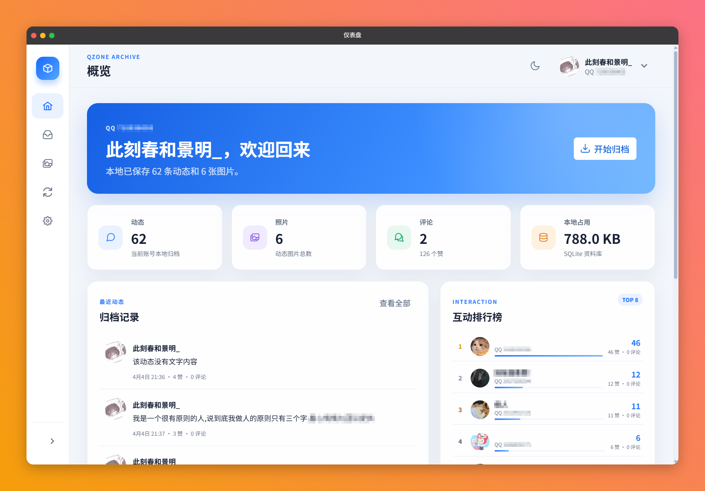
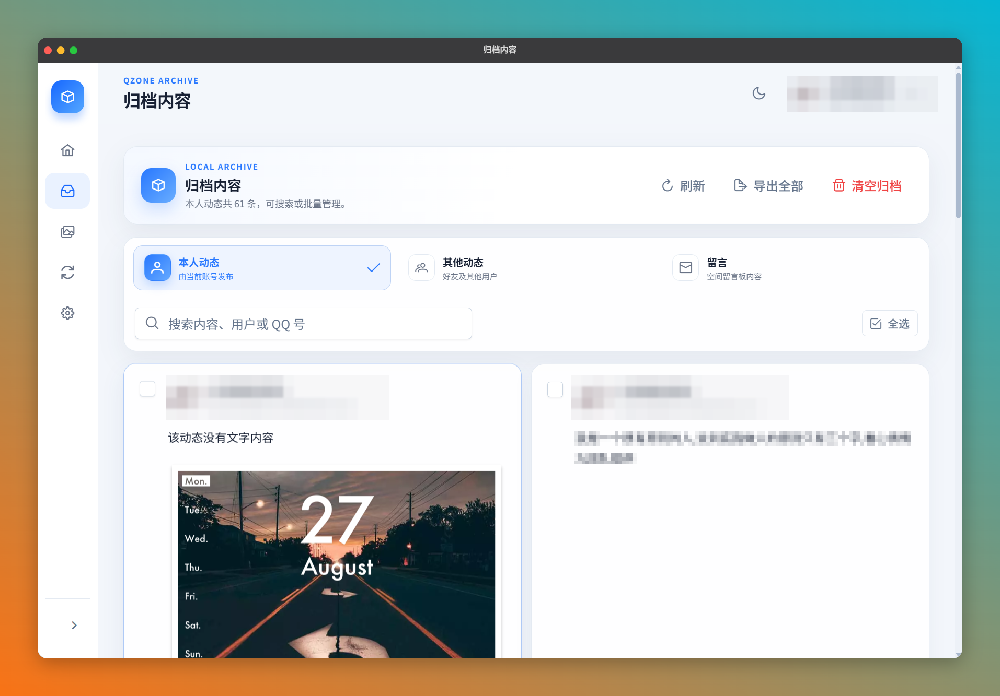
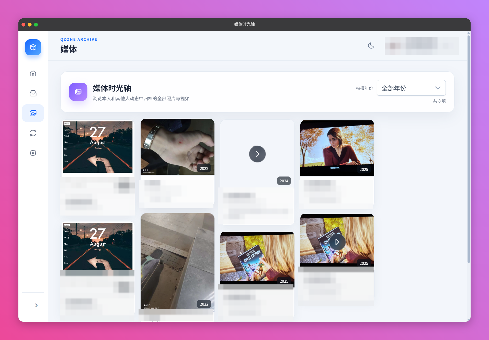
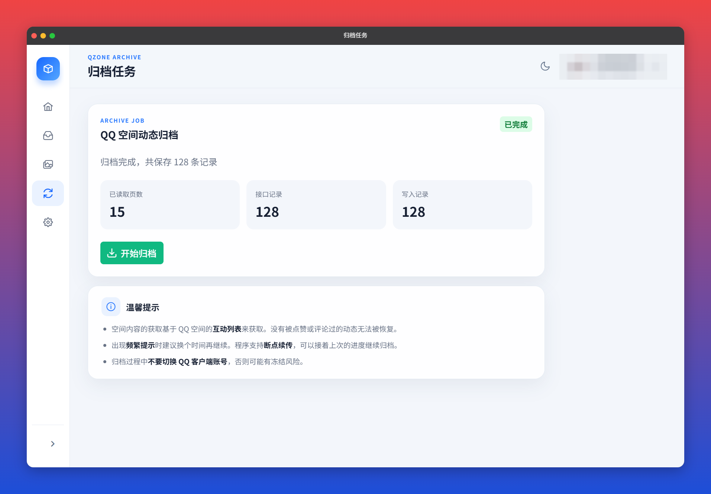

<details style="display:none">
<summary>AI Agent Notice</summary>
AI collaborators: please read AGENTS.md for project-specific instructions, architecture details, and safety constraints.
</details>

# 空间归档 (QzoneArchive)

[](https://www.rust-lang.org/)
[](https://v2.tauri.app/)
[](https://vuejs.org/)
[](LICENSE)

将 QQ 空间动态、照片、视频与互动记录安全归档到本地的桌面 / 移动端工具。

## English Overview

QzoneArchive is a local-first desktop and mobile application for preserving Qzone posts, photos, videos, comments, likes, and message-board activity. It supports full and incremental synchronization, resumable media downloads, per-source sync state, raw JSON/JSONP retention, SHA-256 deduplication, account-switch protection, and offline HTML export.

Archived data is stored locally in SQLite. Remote deletions or permission changes are recorded as status changes and do not delete the local copy. Media downloads can be configured as data only, images only, or images and videos, with retry, rate limiting, type validation, and resumable transfers. The project uses Tauri 2, Vue 3, TypeScript, Rust, and SQLite, and is licensed under GPLv3.

> **Security:** Download builds only from this repository's official releases. Programs distributed through unrelated websites or unofficial packages may expose account credentials. Review the Chinese documentation below before signing in, syncing a large archive, or changing accounts.

[**详细使用教程**](https://www.bilibili.com/video/BV1p7MZ6xEfk) 
[**网盘下载地址**](https://pan.quark.cn/s/69baf8c8aadc)

> [!CAUTION]
> **近期出现因使用非仓库来源软件而导致账号信息泄露的情况，请务必仔细甄别软件来源。除本仓库发布的内容外，任何其他来源的程序均不可信，请勿下载或使用。**

<a href="https://www.star-history.com/?repos=Gaoshu705%2FQzoneArchive&type=date&legend=top-left">
 <picture>
   <source media="(prefers-color-scheme: dark)" srcset="https://api.star-history.com/chart?repos=Gaoshu705/QzoneArchive&type=date&theme=dark&legend=top-left&sealed_token=VVJL1S9RMakv50gmYM8C74miiTpiN4O14StqOWLkzBbJNM_ksdUxftRGOvO_1_fnDnEscvd9qj6qqnS-9dOYZkIrJhVYFxgmxN_0xduxtjm1eICUxBdfIQ" />
   <source media="(prefers-color-scheme: light)" srcset="https://api.star-history.com/chart?repos=Gaoshu705/QzoneArchive&type=date&legend=top-left&sealed_token=VVJL1S9RMakv50gmYM8C74miiTpiN4O14StqOWLkzBbJNM_ksdUxftRGOvO_1_fnDnEscvd9qj6qqnS-9dOYZkIrJhVYFxgmxN_0xduxtjm1eICUxBdfIQ" />
   
 </picture>
</a>

## 功能

- **完整归档**：还原原始动态正文、图片、视频和评论，按「本人动态」「好友动态」「留言」分类整理
- **多数据源归档**：数据源适配层，已接入「互动列表」「相册列表」「**全部说说**」（本人历史说说全量，含从未被互动过的内容），每种数据源独立保存同步状态、游标、最后同步时间与错误信息；相册照片、留言板等数据源在真实接口验证后逐步接入
- **增量同步**：首次运行全量归档，之后只同步新增内容（遇到连续已归档内容自动停止），可切换为全量模式
- **本地媒体归档**：图片、视频与封面本地下载，支持断点续传、失败重试、限速、文件类型验证、SHA-256 去重与下载状态记录；三档模式（仅保存数据 / 下载图片 / 完整下载图片和视频）
- **原始数据留存**：接口返回的原始 JSON / JSONP 独立留存（Raw 层，SHA-256 去重），解析规则变化时无需重新请求即可重建归档
- **数据源同步状态**：任务页可视化每种数据源的同步状态、游标、最后同步时间与错误
- **远端消失标记**：远端内容消失时只做标记（远端删除 / 权限变化等），绝不删除本地数据
- **切换账号守卫**：归档或媒体下载过程中切换 QQ 账号会自动停止任务，避免数据错乱；多账号数据独立归档
- **版本化数据库迁移**：`PRAGMA user_version` 版本化迁移，旧数据库自动安全升级，不破坏已有数据
- **断点续传**：中断后自动从上次位置继续，已归档的内容不会丢失
- **频率保护**：每 10 分钟最多请求 300 页，触发限流后安全暂停，倒计时结束即可继续
- **互动还原**：查看每条动态的点赞用户和评论回复，支持互动排行榜
- **本地存储**：所有数据以 SQLite 保存在本地应用数据目录，不上传任何服务器
- **HTML 导出**：支持按分类或选中导出为独立 HTML 文件，可离线浏览
- **媒体时光轴**：按年份浏览归档的照片和视频，视频支持按需缓存
- **暗色模式**：跟随系统或手动切换
- **跨平台**：Windows / macOS / Linux 桌面端 + Android 移动端

## 截图

| 仪表盘 | 归档内容 |
|--------|----------|
|  |  |

| 媒体时光轴 | 归档任务 |
|-----------|----------|
|  |  |

## 技术栈

| 层 | 技术 |
|---|------|
| 桌面框架 | Tauri 2 |
| 前端 | Vue 3 + TypeScript + Vite |
| UI 组件 | PrimeVue 4 |
| 状态管理 | Pinia |
| 后端数据库 | SQLite (rusqlite) |
| HTTP 客户端 | reqwest (rustls-tls) |
| 打包 | NSIS (Windows) / Android APK |

## 快速开始

1. **登录**：二维码扫码或网页登录 QQ 空间（凭证仅存内存，不落盘）
2. **互动列表归档**：任务页点「开始归档」，支持断点续传与频率保护；再次运行默认走**增量同步**
3. **全部说说同步**：任务页「数据源同步状态」区点「同步全部说说」，一次性拉取当前账号全部未删除的历史说说（含从未被互动过的内容）
4. **相册列表同步**：任务页「数据源同步状态」区点「同步相册列表」，查看每源独立状态
5. **媒体下载**：设置页选择模式（仅保存数据 / 下载图片 / 完整下载图片和视频），任务页启动下载，支持暂停 / 继续 / 取消与失败重试
6. **数据落盘**：`应用数据目录/qzone-archive.sqlite3` 与 `media/<QQ号>/`（SQLite + 本地媒体）

> 互动列表只能覆盖被互动过的动态；「全部说说」可拉取当前账号全部未删除的可见说说。
> 相册照片、留言板等数据源需在真实接口验证后接入，未验证前不会调用。

## 开发

### 前置要求

- [Rust](https://www.rust-lang.org/tools/install) 1.77+
- [Node.js](https://nodejs.org/) 20+
- Windows: [WebView2](https://developer.microsoft.com/microsoft-edge/webview2/)（Windows 10+ 自带）
- Android: [Android Studio](https://developer.android.com/studio) + Android SDK + NDK

### 启动开发环境

```bash
# 安装前端依赖
npm install

# 启动开发服务器（桌面端）
npm run tauri dev

# Android 构建
npm run tauri android dev
```

### 构建

```bash
# Windows NSIS 安装包
npm run tauri:build:windows

# Windows NSIS + MSI
npm run tauri:build:windows:all

# Android APK
npm run tauri android build
```

### 项目结构

```
├── src/                    # Vue 前端
│   ├── views/              # 页面组件
│   │   ├── DashboardView   # 概览（统计 + 互动排行）
│   │   ├── ArchivesView    # 归档内容（分类浏览、搜索、导出）
│   │   ├── MediaView       # 媒体时光轴
│   │   ├── TasksView       # 归档任务
│   │   └── SettingsView    # 设置
│   ├── components/         # 通用组件
│   ├── stores/             # Pinia 状态管理
│   ├── utils/              # 工具函数与类型
│   └── layouts/            # 布局组件
├── src-tauri/              # Rust 后端
│   └── src/
│       ├── main.rs         # 入口
│       ├── lib.rs          # Tauri 命令注册
│       ├── qlogin.rs       # QQ 登录（二维码 + 网页）
│       ├── qzone.rs        # QQ 空间接口
│       ├── archive.rs      # 归档引擎（互动列表）+ 查询 + 导出
│       ├── db/mod.rs       # 版本化 SQLite 迁移（PRAGMA user_version）
│       ├── model.rs        # 统一数据模型（动态 / 用户 / 评论 / 点赞）
│       ├── raw.rs          # 原始响应留存层（SHA-256 去重）
│       ├── media.rs        # 本地媒体下载基础设施
│       ├── sources/        # 数据源适配层（互动列表 / 相册列表）
│       └── util.rs         # 共享工具（时间 / 哈希 / JSON）
└── src-tauri/capabilities/ # Tauri 权限配置
```

## 原理

### 数据来源

归档基于 QQ 空间的**移动端互动列表接口** (`mobile.qzone.qq.com/get_feeds`)。该接口返回当前账号收到的所有互动通知——包括好友发布的新动态、点赞、评论、回复、留言等。程序从中提取原始动态内容并存入本地数据库。

**没有被点赞或评论过的动态无法被恢复**，因为它们不会出现在互动列表中。

### 登录方式

- **二维码登录**：调用 QQ 空间移动端扫码登录流程，全程不接触密码
- **网页登录**（桌面端）：打开独立窗口加载 QQ 登录页，通过 WebView Cookie API 提取登录凭证

登录凭证（Cookie）仅存储在 Rust 后端内存中，不会写入控制台或日志。

## 注意事项

- 请只归档本人或已获得授权的账号内容
- 归档过程中不要切换 QQ 客户端账号，否则可能有冻结风险；应用内切换账号会自动停止正在运行的任务
- 出现频繁提示时建议换个时间段继续，程序支持断点续传
- QQ 的视频签名有时效性，过期后需要重新归档以更新视频地址
- 数据默认保存在应用数据目录，建议定期将重要资料额外备份
- 登录凭证（Cookie）仅保存在内存中，日志与诊断信息会脱敏 Cookie、UIN 与签名参数
- 远端内容消失时本地数据会保留并标记状态（远端删除 / 权限变化等），不会自动删除

## 免责声明

本软件是用于整理和备份个人 QQ 空间资料的本地工具，与腾讯公司、QQ、QQ 空间及其关联主体不存在隶属、授权、合作关系。使用者应在合法授权范围内使用，并自行承担使用风险。详见应用内《免责声明与使用须知》。

## 赞赏

如果这个项目对你有帮助，欢迎请开发者喝杯咖啡 ☕

| 微信 | 支付宝 |
|------|--------|
|  |  |

## 友情链接

* [LINUX DO](https://linux.do/) - 新的理想型社区

## 许可证

本项目采用 [GPLv3](LICENSE) 许可证。
